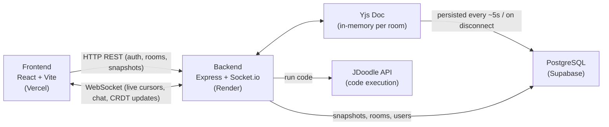

# CodeCollab 🚀

Real-time collaborative code editor. Multiple developers edit code simultaneously, see live cursors, chat, and run code — all in the browser.

> VS Code + Google Docs + Online Compiler

**Live Demo:** [code-collab-woad.vercel.app](https://code-collab-woad.vercel.app)

<!--
TODO: record a 15–30s screen capture and drop it here as demo.gif, e.g.:


What to record (one continuous take, 2 browser windows side by side):
  1. Window A creates a room, window B joins with the room code.
  2. Type in window A — show the cursor + text appearing live in window B.
  3. Move the cursor in window B — show the labeled cursor in window A.
  4. Hit Run on a short snippet (e.g. print/console.log) — show output
     appearing in both windows.
  5. (Optional) Open version history and restore an older snapshot.
Keep it under 30s and under ~5MB (gifski or ffmpeg -> gif works well).
-->

---

## Stack

**Backend:** Node.js, Express, Socket.io, PostgreSQL, Passport.js, JWT  
**Frontend:** React 18, Vite, Tailwind CSS, Monaco Editor, Socket.io Client  
**Real-time Sync:** Yjs CRDT  
**Execution:** JDoodle API (C++17, Python, JavaScript, TypeScript)  
**Infra:** Render (backend) · Vercel (frontend) · Supabase (PostgreSQL)

---

## Features

| Feature | Description |
|---------|-------------|
| Real-time editing | Yjs CRDT synced via binary Socket.io frames |
| Remote cursors | Live cursors with color + username labels |
| Editor / Viewer roles | Separate room codes — edit or read-only access |
| Code execution | 4 languages via JDoodle API |
| Version history | Manual snapshots + auto-save every 10 min |
| Integrated chat | Typing indicators + system messages |
| Presence | Color-coded avatars for all users in room |
| Auth | Email/password + Google OAuth, JWT-based |
| Password Reset | Brevo HTTP API (bypasses Render SMTP firewalls) with stateless single-use JWTs |
| UI/UX | Premium Glassmorphic design, GSAP interactive backgrounds |
---

## Local Setup

```bash
git clone https://github.com/codertoji-spec/CodeCollab.git
cd CodeCollab
```

### Backend
```bash
cd backend
cp .env.example .env   # fill in values — JDOODLE_CLIENT_ID/SECRET are required, server won't start without them
npm install
node src/index.js
```

### Frontend
```bash
cd frontend
cp .env.example .env   # defaults already match the backend's default port
npm install
npm run dev
```

### Environment Variables

**Backend `.env`:**
```
PORT=5000
DATABASE_URL=postgresql://...
JWT_SECRET=your_secret
SESSION_SECRET=your_secret
CLIENT_URL=http://localhost:5173
SERVER_URL=http://localhost:5000
GOOGLE_CLIENT_ID=...
GOOGLE_CLIENT_SECRET=...
JDOODLE_CLIENT_ID=...
JDOODLE_CLIENT_SECRET=...
BREVO_API_KEY=...
EMAIL_USER=...
```

**Frontend `.env`:**
```
VITE_API_URL=http://localhost:5000/api
VITE_SOCKET_URL=http://localhost:5000
```

---

## Deployment

| Service | Platform | URL |
|---------|----------|-----|
| Frontend | Vercel | code-collab-woad.vercel.app |
| Backend | Render | codecollab-gcgs.onrender.com |
| Database | Supabase | PostgreSQL (connection pooler) |

> **Note:** Code execution uses JDoodle API (200 req/day free tier).  
> Run button works for all 4 languages in the deployed version.

---

## Architecture



### Real-time Sync (Yjs CRDT)
- Server holds one `Y.Doc` per active room in memory
- Client updates sent as binary `Uint8Array` frames
- State persisted to PostgreSQL every 5s
- On join, server sends full state vector (`yjs-init`)

### Socket Authentication
JWT verified on handshake. `userId` and `username` always read from `socket.verifiedUser` — client payload never trusted.

### Version History
- Manual save / auto-save every 10 min / snapshot on language change
- Max 100 snapshots per room
- Restore syncs to all peers via CRDT transaction

---

## Known Limitations

- **JDoodle free tier: 200 requests/day** across the whole deployed app. Once
  hit, the Run button will return an execution error until the quota resets.
  A self-hosted per-language Docker sandbox was scoped as the fix (see
  `backend/sandbox/README.md`) but isn't wired up yet.
- **Go, Rust, and Java are wired up server-side** (`executionService.js`
  already maps them to JDoodle) but not yet exposed in the language dropdown
  (`Dashboard.jsx`/`Room.jsx` only list javascript/python/cpp/typescript) —
  adding them to the UI is a small follow-up, not a backend change.
- **No self-hosted execution sandbox yet** — all code execution is fully
  outsourced to JDoodle's infrastructure; nothing runs untrusted code on this
  server.
- **Room roles are per-user-per-room, not per-session** — joining a room's
  view-only link demotes that user's role for that room even if they were
  previously an editor there (see `roomController.js`). Intentional, but
  worth knowing if you're testing with one account across two tabs.
- **In-memory room state** (`roomMeta` in `index.js`) means a backend
  restart drops live presence/cursor state for active rooms — the Yjs
  document itself is safe (persisted to Postgres), but users will need to
  rejoin the room in the UI.

---

## Socket Events

| Event | Direction | Description |
|-------|-----------|-------------|
| `join-room` | C→S | Join room with role |
| `room-state` | S→C | Initial language + user list |
| `yjs-init` | S→C | Full Yjs state on join |
| `yjs-update` | C↔S | Binary CRDT update |
| `users-update` | S→C | Updated user list |
| `language-change` | C↔S | Language switch |
| `cursor-move` / `cursor-update` | C↔S | Remote cursors |
| `chat-message` | C↔S | Chat |
| `typing` / `typing-update` | C↔S | Typing indicator |
| `execution-result` | C↔S | Code run output |

---

## Google OAuth Setup

1. [console.cloud.google.com](https://console.cloud.google.com) → new project
2. OAuth 2.0 Client ID (Web app)
3. Authorized redirect URI: `https://codecollab-gcgs.onrender.com/api/auth/google/callback`
4. Add `GOOGLE_CLIENT_ID` + `GOOGLE_CLIENT_SECRET` to backend env

---

## Security Notes
- Socket auth via JWT handshake
- REST auth middleware with token caching
- Snapshot saves are atomic DB transactions
- Chat messages sanitized + capped at 500 chars server-side
- Yjs editor role verified server-side before applying updates
- Password reset tokens are statelessly bound to the user's `password_hash`, ensuring single-use and immediate invalidation upon password change.

---

## Testing

```bash
cd backend && npm test
```

| Suite | What it tests |
|-------|--------------|
| `auth.test.js` | Token cache, invalidation, bad tokens |
| `yjsManager.test.js` | Race condition fix, doc creation, update roundtrip |
